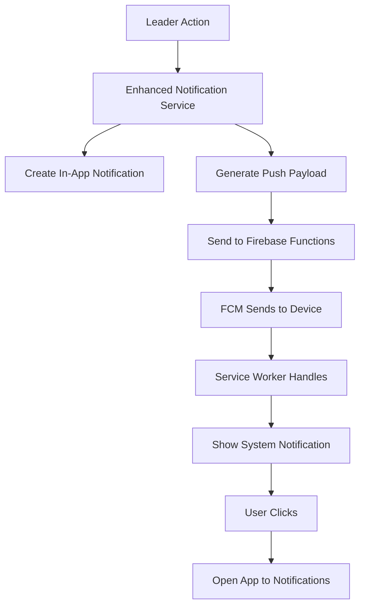

# Push Notifications Setup Guide for SAT Mobile

This guide explains how to set up and configure push notifications for the SAT Mobile app, so users receive notifications even when the app is closed.

## Overview

The push notification system includes:
- **Firebase Cloud Messaging (FCM)** for web push notifications
- **Capacitor Push Notifications** for mobile apps
- **Enhanced notification service** that integrates with existing in-app notifications
- **Device token management** for tracking user devices
- **Background service worker** for handling notifications when app is closed

## Features

- 🔄 **Real-time notifications** when the app is closed or in background
- 📱 **Cross-platform support** (Web, Android, iOS)
- 🎯 **Targeted notifications** only to relevant admins
- 🔧 **User-friendly settings** for enabling/disabling notifications
- 🧪 **Test functionality** to verify push notifications work
- 🔐 **Secure token management** and cleanup

## Setup Instructions

### 1. Firebase Configuration

#### Generate VAPID Key
1. Go to [Firebase Console](https://console.firebase.google.com/)
2. Select your project (`sat-mobile-de6f1`)
3. Go to **Project Settings** > **Cloud Messaging**
4. Under **Web Push certificates**, click **Generate Key Pair**
5. Copy the key pair and add it to your `.env` file:

```env
REACT_APP_FIREBASE_VAPID_KEY=your-generated-vapid-key-here
```

#### Enable FCM API
1. In Firebase Console, go to **Project Settings** > **General**
2. Scroll down to **Google Cloud Platform (GCP) resource location**
3. Make sure the location is set (required for FCM)

### 2. Deploy Firebase Functions

The push notification system requires Firebase Functions to send notifications:

```bash
# Navigate to functions directory
cd functions

# Install dependencies
npm install

# Deploy functions
firebase deploy --only functions
```

### 3. Configure Service Worker

The service worker is already created at `/public/firebase-messaging-sw.js`. Make sure your web server serves this file correctly.

### 4. Mobile App Configuration

For Capacitor mobile apps:

```bash
# Add push notification capability
npm install @capacitor/push-notifications

# Update native projects
npx cap sync

# Build and run
npx cap run android
# or
npx cap run ios
```

#### Android Configuration

Add to `android/app/src/main/AndroidManifest.xml`:

```xml
<!-- Push Notifications Permissions -->
<uses-permission android:name="android.permission.WAKE_LOCK" />
<uses-permission android:name="android.permission.VIBRATE" />

<!-- FCM Service -->
<service
    android:name="com.google.firebase.messaging.FirebaseMessagingService"
    android:exported="false">
    <intent-filter>
        <action android:name="com.google.firebase.MESSAGING_EVENT" />
    </intent-filter>
</service>
```

#### iOS Configuration

Add to `ios/App/App/Info.plist`:

```xml
<key>UIBackgroundModes</key>
<array>
    <string>remote-notification</string>
</array>
```

### 5. Test the Setup

1. **Login as Admin**: Push notifications are only available for admin users
2. **Go to Profile Settings**: Navigate to Profile > Push Notification Settings
3. **Enable Notifications**: Click "Enable Notifications" and grant permission
4. **Send Test**: Use the "Send Test" button to verify notifications work
5. **Test Real Notifications**: Have a leader perform actions (add members, confirm attendance, etc.)

## How It Works

### User Flow

1. **Admin users** see push notification settings in their profile
2. When enabled, the app requests notification permissions
3. A **device token** is generated and stored in Firestore
4. When **leaders perform actions**, the system:
   - Creates an in-app notification
   - Sends a push notification to linked admin devices
   - Shows notification even if app is closed

### Technical Flow



### Device Token Management

- Tokens are stored per church in Firestore: `churches/{churchId}/deviceTokens/{token}`
- Tokens are automatically cleaned up when invalid
- Users can have multiple tokens (different devices/browsers)

## Troubleshooting

### Common Issues

#### 1. Notifications Not Showing

**Check permissions:**
```javascript
// In browser console
Notification.permission
// Should return "granted"
```

**Check service worker:**
```javascript
// In browser console
navigator.serviceWorker.getRegistrations()
// Should show firebase-messaging-sw.js
```

#### 2. VAPID Key Issues

- Make sure the VAPID key is correctly set in `.env`
- Regenerate the key in Firebase Console if needed
- Restart the development server after changing `.env`

#### 3. Mobile App Issues

- Ensure `@capacitor/push-notifications` is installed
- Run `npx cap sync` after installation
- Check platform-specific configurations

#### 4. Function Deployment Issues

```bash
# Check function logs
firebase functions:log

# Redeploy specific function
firebase deploy --only functions:sendPushNotification
```

### Debug Mode

Enable debug logging in browser console:

```javascript
// Enable FCM debug logging
localStorage.setItem('firebase-messaging-debug', 'true');
location.reload();
```

## Security Considerations

- **Device tokens** are automatically expired and cleaned up
- **Notifications** only contain minimal information (no sensitive data)
- **Admin-only access** - push notifications are only available to admin users
- **Church context** - notifications are scoped to specific churches
- **Permission-based** - requires explicit user consent

## Customization

### Notification Content

Modify notification content in `pushNotificationService.ts`:

```typescript
createNotificationPayload(notification: AdminNotification): PushNotificationPayload {
  // Customize notification titles and content based on activity type
}
```

### Notification Actions

Add custom actions in the service worker:

```javascript
// In firebase-messaging-sw.js
actions: [
  {
    action: 'view_details',
    title: 'View Details'
  },
  {
    action: 'mark_read',
    title: 'Mark as Read'
  }
]
```

## Environment Variables

Required environment variables:

```env
# Firebase Core
REACT_APP_FIREBASE_API_KEY=your-api-key
REACT_APP_FIREBASE_AUTH_DOMAIN=your-domain
REACT_APP_FIREBASE_PROJECT_ID=your-project-id
REACT_APP_FIREBASE_MESSAGING_SENDER_ID=your-sender-id

# Push Notifications
REACT_APP_FIREBASE_VAPID_KEY=your-vapid-key

# Optional: Development mode
REACT_APP_USE_FIREBASE_EMULATOR=false
```

## Files Created/Modified

### New Files
- `services/pushNotificationService.ts` - Core push notification service
- `services/enhancedNotificationIntegration.ts` - Enhanced notification wrapper
- `components/notifications/PushNotificationSettings.tsx` - User settings component
- `public/firebase-messaging-sw.js` - Service worker for background notifications
- `functions/index.js` - Firebase Functions for sending notifications
- `functions/package.json` - Function dependencies

### Modified Files
- `firebase.config.ts` - Added messaging initialization
- `capacitor.config.ts` - Added push notification configuration
- `contexts/FirebaseAppContext.tsx` - Integrated enhanced notifications
- `components/views/ProfileSettingsView.tsx` - Added push settings UI
- `.env` - Added VAPID key configuration

## Next Steps

1. **Generate and configure VAPID key** in Firebase Console
2. **Deploy Firebase Functions** for sending notifications
3. **Test on different devices** and browsers
4. **Monitor notification delivery** using Firebase Console
5. **Gather user feedback** and iterate on notification content

## Support

For issues or questions:
1. Check the troubleshooting section above
2. Review Firebase Console for errors
3. Check browser console for client-side issues
4. Review function logs for server-side issues

---

**Note**: Push notifications require HTTPS in production. Make sure your deployment uses HTTPS for web push notifications to work properly.
